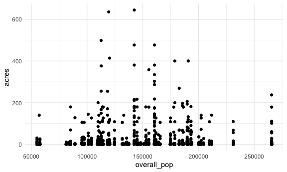
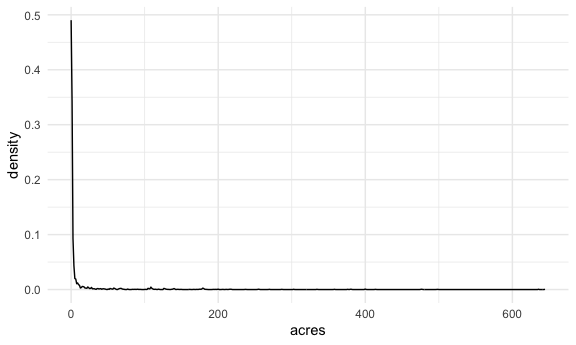

EDA
================
Nicole Criscuolo
2025-11-19

``` r
parks_df =
  read.csv("data/Parks_Properties_20251104.csv") |> 
  janitor::clean_names() |> 
  select(acquisitiondate, acres, communityboard, eapply, gispropnum, location, pip_ratable, subcategory, typecategory, zipcode, multipolygon) |> 
  rename(
    "id" = "communityboard",
    "park_name"= "eapply",
    "unique_id" = "gispropnum",
    "inpsected" = "pip_ratable"
  ) |> 
  mutate(
    acquisitiondate = format(as.Date(acquisitiondate, format = "%Y %b %d %I:%M:%S %p"), "%m/%d/%Y"),
    n_communities = str_count(id, ",") + 1
  ) |> 
  separate_rows(id, sep = ",") |> 
  mutate(acres = as.numeric(acres) / n_communities) |> 
  select(-n_communities)
```

    ## Warning: There was 1 warning in `mutate()`.
    ## ℹ In argument: `acres = as.numeric(acres)/n_communities`.
    ## Caused by warning:
    ## ! NAs introduced by coercion

``` r
demo_df =
  read_excel("data/2022-chp-pud.xlsx", sheet = 4, range = cell_rows(2:67)) |> 
  janitor::clean_names() |> 
  filter(row_number() > 6) |> 
  select(-starts_with(c("nyc_comparison_", "lower_95cl_", "upper_95cl_"))) |> 
  select(id:rent_burden, air_pollution, child_obesity:unmet_med_care_reliability_note,
         obesity:binge_drink_reliability_note, premature_mort_number:life_expectancy) |> 
  rename("neighbourhood" = "name")|> 
  mutate(id = as.character(id))
```

    ## New names:
    ## • `lower_95CL` -> `lower_95CL...16`
    ## • `upper_95CL` -> `upper_95CL...17`
    ## • `NYC_Comparison` -> `NYC_Comparison...18`
    ## • `lower_95CL` -> `lower_95CL...20`
    ## • `upper_95CL` -> `upper_95CL...21`
    ## • `NYC_Comparison` -> `NYC_Comparison...22`
    ## • `NYC_comparison` -> `NYC_comparison...24`
    ## • `NYC_Comparison` -> `NYC_Comparison...26`
    ## • `lower_95CL` -> `lower_95CL...28`
    ## • `upper_95CL` -> `upper_95CL...29`
    ## • `NYC_Comparison` -> `NYC_Comparison...30`
    ## • `lower_95CL` -> `lower_95CL...32`
    ## • `upper_95CL` -> `upper_95CL...33`
    ## • `NYC_Comparison` -> `NYC_Comparison...34`
    ## • `lower_95CL` -> `lower_95CL...36`
    ## • `upper_95CL` -> `upper_95CL...37`
    ## • `NYC_Comparison` -> `NYC_Comparison...38`
    ## • `lower_95CL` -> `lower_95CL...41`
    ## • `upper_95CL` -> `upper_95CL...42`
    ## • `NYC_Comparison` -> `NYC_Comparison...43`
    ## • `lower_95CL` -> `lower_95CL...45`
    ## • `upper_95CL` -> `upper_95CL...46`
    ## • `NYC_Comparison` -> `NYC_Comparison...47`
    ## • `lower_95CL` -> `lower_95CL...50`
    ## • `upper_95CL` -> `upper_95CL...51`
    ## • `NYC_Comparison` -> `NYC_Comparison...52`
    ## • `lower_95CL` -> `lower_95CL...55`
    ## • `upper_95CL` -> `upper_95CL...56`
    ## • `NYC_Comparison` -> `NYC_Comparison...57`
    ## • `NYC_Comparison_Pvalues` -> `NYC_Comparison_Pvalues...58`
    ## • `lower_95CL` -> `lower_95CL...63`
    ## • `upper_95CL` -> `upper_95CL...64`
    ## • `NYC_Comparison` -> `NYC_Comparison...65`
    ## • `lower_95CL` -> `lower_95CL...68`
    ## • `upper_95CL` -> `upper_95CL...69`
    ## • `NYC_Comparison` -> `NYC_Comparison...70`
    ## • `NYC_comparison` -> `NYC_comparison...73`
    ## • `lower_95CL` -> `lower_95CL...75`
    ## • `upper_95CL` -> `upper_95CL...76`
    ## • `NYC_Comparison` -> `NYC_Comparison...77`
    ## • `NYC_Comparison` -> `NYC_Comparison...81`
    ## • `NYC_Comparison` -> `NYC_Comparison...83`
    ## • `NYC_Comparison` -> `NYC_Comparison...86`
    ## • `lower_95CL` -> `lower_95CL...88`
    ## • `upper_95CL` -> `upper_95CL...89`
    ## • `NYC_Comparison` -> `NYC_Comparison...90`
    ## • `lower_95CL` -> `lower_95CL...93`
    ## • `upper_95CL` -> `upper_95CL...94`
    ## • `NYC_Comparison` -> `NYC_Comparison...95`
    ## • `lower_95CL` -> `lower_95CL...98`
    ## • `upper_95CL` -> `upper_95CL...99`
    ## • `NYC_Comparison` -> `NYC_Comparison...100`
    ## • `NYC_Comparison_Pvalues` -> `NYC_Comparison_Pvalues...101`
    ## • `lower_95CL` -> `lower_95CL...104`
    ## • `upper_95CL` -> `upper_95CL...105`
    ## • `NYC_Comparison` -> `NYC_Comparison...106`
    ## • `NYC_Comparison_Pvalues` -> `NYC_Comparison_Pvalues...107`
    ## • `lower_95CL` -> `lower_95CL...110`
    ## • `upper_95CL` -> `upper_95CL...111`
    ## • `NYC_Comparison` -> `NYC_Comparison...112`
    ## • `NYC_Comparison_Pvalues` -> `NYC_Comparison_Pvalues...113`
    ## • `lower_95CL` -> `lower_95CL...116`
    ## • `upper_95CL` -> `upper_95CL...117`
    ## • `NYC_Comparison` -> `NYC_Comparison...118`
    ## • `NYC_Comparison_Pvalues` -> `NYC_Comparison_Pvalues...119`
    ## • `lower_95CL` -> `lower_95CL...122`
    ## • `upper_95CL` -> `upper_95CL...123`
    ## • `NYC_Comparison` -> `NYC_Comparison...124`
    ## • `NYC_Comparison_Pvalues` -> `NYC_Comparison_Pvalues...125`
    ## • `lower_95CL` -> `lower_95CL...128`
    ## • `upper_95CL` -> `upper_95CL...129`
    ## • `NYC_Comparison` -> `NYC_Comparison...130`
    ## • `NYC_Comparison_Pvalues` -> `NYC_Comparison_Pvalues...131`
    ## • `lower_95CL` -> `lower_95CL...134`
    ## • `upper_95CL` -> `upper_95CL...135`
    ## • `NYC_Comparison` -> `NYC_Comparison...136`
    ## • `NYC_Comparison_Pvalues` -> `NYC_Comparison_Pvalues...137`
    ## • `lower_95CL` -> `lower_95CL...139`
    ## • `upper_95CL` -> `upper_95CL...140`
    ## • `NYC_Comparison` -> `NYC_Comparison...141`
    ## • `lower_95CL` -> `lower_95CL...143`
    ## • `upper_95CL` -> `upper_95CL...144`
    ## • `NYC_Comparison` -> `NYC_Comparison...145`
    ## • `lower_95CL` -> `lower_95CL...150`
    ## • `upper_95CL` -> `upper_95CL...151`
    ## • `NYC_Comparison` -> `NYC_Comparison...152`
    ## • `NYC_Comparison_Pvalues` -> `NYC_Comparison_Pvalues...153`
    ## • `lower_95CL` -> `lower_95CL...156`
    ## • `upper_95CL` -> `upper_95CL...157`
    ## • `NYC_Comparison` -> `NYC_Comparison...158`
    ## • `NYC_Comparison_Pvalues` -> `NYC_Comparison_Pvalues...159`
    ## • `lower_95CL` -> `lower_95CL...162`
    ## • `upper_95CL` -> `upper_95CL...163`
    ## • `NYC_Comparison` -> `NYC_Comparison...164`
    ## • `NYC_Comparison_Pvalues` -> `NYC_Comparison_Pvalues...165`
    ## • `lower_95CL` -> `lower_95CL...168`
    ## • `upper_95CL` -> `upper_95CL...169`
    ## • `NYC_Comparison` -> `NYC_Comparison...170`
    ## • `NYC_Comparison_Pvalues` -> `NYC_Comparison_Pvalues...171`
    ## • `lower_95CL` -> `lower_95CL...177`
    ## • `upper_95CL` -> `upper_95CL...178`
    ## • `NYC_Comparison` -> `NYC_Comparison...179`
    ## • `NYC_Comparison_Pvalues` -> `NYC_Comparison_Pvalues...180`
    ## • `lower_95CL` -> `lower_95CL...182`
    ## • `upper_95CL` -> `upper_95CL...183`
    ## • `NYC_comparison` -> `NYC_comparison...184`
    ## • `lower_95CL` -> `lower_95CL...187`
    ## • `upper_95CL` -> `upper_95CL...188`
    ## • `NYC_comparison` -> `NYC_comparison...189`
    ## • `NYC_Comparison` -> `NYC_Comparison...192`
    ## • `lower_95CL` -> `lower_95CL...194`
    ## • `upper_95CL` -> `upper_95CL...195`
    ## • `NYC_Comparison` -> `NYC_Comparison...196`

``` r
full_df =
  inner_join(parks_df, demo_df)
```

    ## Joining with `by = join_by(id)`

``` r
full_df |> 
  group_by(id, neighbourhood) |> 
  summarize(
    total_acres = sum(acres, na.rm = TRUE),
    total_population = sum(overall_pop, na.rm = TRUE)
  ) |> 
  mutate(acres_per_capita = total_acres / total_population) |> 
  knitr::kable()
```

    ## `summarise()` has grouped output by 'id'. You can override using the `.groups`
    ## argument.

| id | neighbourhood | total_acres | total_population | acres_per_capita |
|:---|:---|---:|---:|---:|
| 101 | Financial District | 67.9250 | 1155291.4 | 0.0000588 |
| 102 | Greenwich Village and Soho | 24.3400 | 3033748.8 | 0.0000080 |
| 103 | Lower East Side and Chinatown | 117.6670 | 13624439.2 | 0.0000086 |
| 104 | Clinton and Chelsea | 24.0990 | 2472127.9 | 0.0000097 |
| 105 | Midtown | 163.9027 | 570973.4 | 0.0002871 |
| 106 | Stuyvesant Town and Turtle Bay | 161.8627 | 2924689.0 | 0.0000553 |
| 107 | Upper West Side | 378.7337 | 6072426.6 | 0.0000624 |
| 108 | Upper East Side | 189.2372 | 3811608.7 | 0.0000496 |
| 109 | Morningside Heights and Hamilton Heights | 230.9185 | 2911158.0 | 0.0000793 |
| 110 | Central Harlem | 253.3300 | 5860207.9 | 0.0000432 |
| 111 | East Harlem | 661.6635 | 7222936.8 | 0.0000916 |
| 112 | Washington Heights and Inwood | 600.3868 | 5384019.9 | 0.0001115 |
| 201 | Mott Haven and Melrose | 66.9350 | 4249683.7 | 0.0000158 |
| 202 | Hunts Point and Longwood | 102.9784 | 1763063.0 | 0.0000584 |
| 203 | Morrisania and Crotona | 153.1645 | 4191069.9 | 0.0000365 |
| 204 | Highbridge and Concourse | 172.5100 | 7187710.0 | 0.0000240 |
| 205 | Fordham and University Heights | 27.9895 | 5302305.6 | 0.0000053 |
| 206 | Belmont and East Tremont | 293.8434 | 3919491.6 | 0.0000750 |
| 207 | Kingsbridge Heights and Bedford | 292.0577 | 3623102.8 | 0.0000806 |
| 208 | Riverdale and Fieldston | 335.7900 | 3337812.4 | 0.0001006 |
| 209 | Parkchester and Soundview | 480.2867 | 7857028.8 | 0.0000611 |
| 210 | Throgs Neck and Co-op City | 725.4310 | 3007388.0 | 0.0002412 |
| 211 | Morris Park and Bronxdale | 418.2203 | 1936459.6 | 0.0002160 |
| 212 | Williamsbridge and Baychester | 307.0709 | 2596448.9 | 0.0001183 |
| 301 | Greenpoint and Williamsburg | 148.3290 | 16026616.8 | 0.0000093 |
| 302 | Fort Greene and Brooklyn Heights | 115.6995 | 8541104.7 | 0.0000135 |
| 303 | Bedford Stuyvesant | 60.4550 | 10963060.8 | 0.0000055 |
| 304 | Bushwick | 45.4105 | 2622815.8 | 0.0000173 |
| 305 | East New York and Starrett City | 475.6239 | 14335950.1 | 0.0000332 |
| 306 | Park Slope and Carroll Gardens | 219.5800 | 3899475.3 | 0.0000563 |
| 307 | Sunset Park | 178.0190 | 4212915.2 | 0.0000423 |
| 308 | Crown Heights and Prospect Heights | 220.9255 | 1909041.0 | 0.0001157 |
| 309 | South Crown Heights and Lefferts Gardens | 182.3320 | 1462718.1 | 0.0001247 |
| 310 | Bay Ridge and Dyker Heights | 460.8019 | 3476621.8 | 0.0001325 |
| 311 | Bensonhurst | 139.0509 | 2727846.9 | 0.0000510 |
| 312 | Borough Park | 46.9100 | 2455318.9 | 0.0000191 |
| 313 | Coney Island | 565.8774 | 3407165.4 | 0.0001661 |
| 314 | Flatbush and Midwood | 181.0490 | 2318825.3 | 0.0000781 |
| 315 | Sheepshead Bay | 804.8034 | 5184543.7 | 0.0001552 |
| 316 | Brownsville | 47.9590 | 4557625.5 | 0.0000105 |
| 317 | East Flatbush | 14.9920 | 1811351.9 | 0.0000083 |
| 318 | Flatlands and Canarsie | 1032.5624 | 6868718.6 | 0.0001503 |
| 401 | Long Island City and Astoria | 187.7657 | 7555648.6 | 0.0000249 |
| 402 | Woodside and Sunnyside | 52.0595 | 5521136.4 | 0.0000094 |
| 403 | Jackson Heights | 269.8739 | 6224445.2 | 0.0000434 |
| 404 | Elmhurst and Corona | 260.9260 | 5965605.1 | 0.0000437 |
| 405 | Ridgewood and Maspeth | 306.7460 | 6474407.2 | 0.0000474 |
| 406 | Rego Park and Forest Hills | 400.3200 | 2405599.1 | 0.0001664 |
| 407 | Flushing and Whitestone | 1055.5212 | 12485561.8 | 0.0000845 |
| 408 | Hillcrest and Fresh Meadows | 662.2892 | 4353369.2 | 0.0001521 |
| 409 | Kew Gardens and Woodhaven | 138.6680 | 2050290.9 | 0.0000676 |
| 410 | South Ozone Park and Howard Beach | 281.0054 | 3864556.1 | 0.0000727 |
| 411 | Bayside and Little Neck | 1082.2672 | 4181405.2 | 0.0002588 |
| 412 | Jamaica and Hollis | 335.8280 | 10636184.4 | 0.0000316 |
| 413 | Queens Village | 805.0367 | 6764808.8 | 0.0001190 |
| 414 | Rockaway and Broad Channel | 1821.5605 | 6534824.6 | 0.0002787 |
| 501 | St. George and Stapleton | 999.0413 | 13292515.6 | 0.0000752 |
| 502 | South Beach and Willowbrook | 3243.8685 | 5837340.6 | 0.0005557 |
| 503 | Tottenville and Great Kills | 3473.9803 | 9148855.7 | 0.0003797 |

``` r
full_df |> 
  group_by(borough) |> 
  summarize(
    total_acres = sum(acres, na.rm = TRUE),
    total_population = sum(overall_pop, na.rm = TRUE)
  ) |> 
  mutate(acres_per_capita = total_acres / total_population) |> 
  knitr::kable()
```

| borough       | total_acres | total_population | acres_per_capita |
|:--------------|------------:|-----------------:|-----------------:|
| Bronx         |    3376.277 |         48971564 |        0.0000689 |
| Brooklyn      |    4940.380 |         96781716 |        0.0000510 |
| Manhattan     |    2874.066 |         55043628 |        0.0000522 |
| Queens        |    7659.867 |         85017843 |        0.0000901 |
| Staten Island |    7716.890 |         28278712 |        0.0002729 |

``` r
full_df |> 
  select(acres) |> 
  summary()
```

    ##      acres         
    ##  Min.   :  0.0010  
    ##  1st Qu.:  0.1547  
    ##  Median :  0.7645  
    ##  Mean   : 12.4380  
    ##  3rd Qu.:  2.4293  
    ##  Max.   :644.3500  
    ##  NA's   :5

``` r
full_df |> 
  arrange(acres) |> 
  filter(row_number() < 10)
```

    ## # A tibble: 9 × 66
    ##   acquisitiondate acres id    park_name unique_id location inpsected subcategory
    ##   <chr>           <dbl> <chr> <chr>     <chr>     <chr>    <chr>     <chr>      
    ## 1 01/31/1962      0.001 406   Strip     Q409      Woodhav… false     "Sitting A…
    ## 2 09/01/1916      0.001 405   Luke J. … Q063      Fresh P… true      "Sitting A…
    ## 3 12/29/1953      0.001 405   N/A       Q360W     LIE Srv… false     ""         
    ## 4 07/20/1934      0.001 315   Sgt. Joy… B094      E. 12 S… true      "Sitting A…
    ## 5 06/14/1932      0.002 401   Dwyer Sq… Q232      Norther… true      "Sitting A…
    ## 6 12/30/1958      0.002 307   Strip     B210N     4 Ave. … false     "EXWY"     
    ## 7 12/16/1965      0.002 310   Strip     B210U     92 St. … false     "EXWY"     
    ## 8 12/29/1953      0.002 404   Strip     Q360X     57 Rd. … false     "STRIP"    
    ## 9 11/25/1958      0.002 405   Strip     Q360Y2    Behind … false     ""         
    ## # ℹ 58 more variables: typecategory <chr>, zipcode <chr>, multipolygon <chr>,
    ## #   borough <chr>, neighbourhood <chr>, overall_pop <dbl>, race_white <dbl>,
    ## #   race_black <dbl>, race_asian <dbl>, race_latino <dbl>, race_other <dbl>,
    ## #   age0to17 <dbl>, age18to24 <dbl>, age25to44 <dbl>, age45to64 <dbl>,
    ## #   age65plus <dbl>, ltd_eng_prof <dbl>, born_outside_us <dbl>,
    ## #   school_absent <dbl>, on_time_hs_grad <dbl>, edu_did_not_complete_hs <dbl>,
    ## #   edu_hs_grad_some_college <dbl>, edu_college_degree_and_higher <dbl>, …

``` r
full_df |>
  arrange(desc(acres)) |> 
  filter(row_number() < 10)
```

    ## # A tibble: 9 × 66
    ##   acquisitiondate acres id    park_name unique_id location inpsected subcategory
    ##   <chr>           <dbl> <chr> <chr>     <chr>     <chr>    <chr>     <chr>      
    ## 1 01/01/1938       644. 502   Franklin… R046      Ft. Wad… false     Large Park 
    ## 2 08/16/1934       636. 411   Alley Po… Q001      Little … false     Large Park 
    ## 3 01/30/1947       498. 414   Rockaway… Q162      Lands u… false     Large Park 
    ## 4 11/20/1929       477. 502   Freshkil… R017      Victory… false     Flagship P…
    ## 5 11/20/1929       477. 503   Freshkil… R017      Victory… false     Flagship P…
    ## 6 07/22/1937       414. 210   Ferry Po… X126      Schley … false     Large Park 
    ## 7 01/03/1920       400  315   Marine P… B057      Flatbus… false     Large Park 
    ## 8 01/03/1920       400  318   Marine P… B057      Flatbus… false     Large Park 
    ## 9 07/26/1928       380. 502   LaTouret… R013      Forest … false     Flagship P…
    ## # ℹ 58 more variables: typecategory <chr>, zipcode <chr>, multipolygon <chr>,
    ## #   borough <chr>, neighbourhood <chr>, overall_pop <dbl>, race_white <dbl>,
    ## #   race_black <dbl>, race_asian <dbl>, race_latino <dbl>, race_other <dbl>,
    ## #   age0to17 <dbl>, age18to24 <dbl>, age25to44 <dbl>, age45to64 <dbl>,
    ## #   age65plus <dbl>, ltd_eng_prof <dbl>, born_outside_us <dbl>,
    ## #   school_absent <dbl>, on_time_hs_grad <dbl>, edu_did_not_complete_hs <dbl>,
    ## #   edu_hs_grad_some_college <dbl>, edu_college_degree_and_higher <dbl>, …

``` r
full_df |> 
  ggplot(aes(x = overall_pop, y = acres)) +
  geom_point()
```

    ## Warning: Removed 5 rows containing missing values or values outside the scale range
    ## (`geom_point()`).



``` r
full_df |> 
  ggplot(aes(x = acres)) +
  geom_density()
```

    ## Warning: Removed 5 rows containing non-finite outside the scale range
    ## (`stat_density()`).



library(sf)

df7_sf \<- st_as_sf(df7, wkt = “multipolygon”, crs = 4326)

plot(df7_sf\[“acres”\], main = “Green Space by Neighborhood”)
